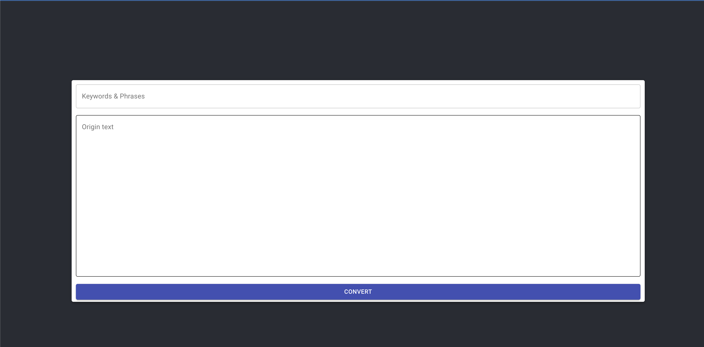

# Requirements 

The web application is built to process classified documents (text format) and remove censored text.

It will remove given keywords and phrases from document text and insert 'XXXX' at the locations where text was removed.

## Input Paramaters

### 1. String of Keywords and phrases

A string of censored keywords and phrases separated by spaces or
commas. Phrases will be enclosed in single or double quotes. Some examples:

### 2. Document Text

The original document text that needs the provided keywords and phrases removed (masked out).

## Returns

Document text with indicated keywords and phrases removed and replaced with XXXX.

# How to run application

The application is written using React, Node and Express. 

You can run the applcation respectively by frontend and backend.

## Frontend

The application is built using React, Typescript and Styling framework is Material UI.

### You can run the application by installing node module through: 
```yarn install```

```yarn start```

## Backend

The backend is written using Node, Express and Typescript.

### You can run the applicatoin by installing node module as frontend

```yarn install```

```yarn serve```

# Execution

As you can see the UI, you can put keywords, and original text in the respective fields.



After you put them, you can simply click 'Convert' to get the result.

Look forward to getting  your feedback.